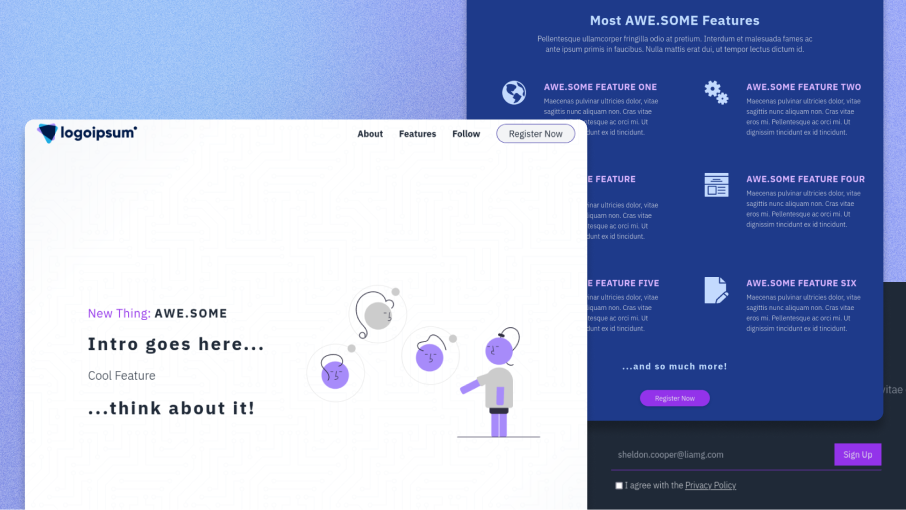

# astro-landing-page

A simple landing page built with Astro and Tailwind CSS.

> Port of the [11ty](https://github.com/ttntm/11ty-landing-page) & [Hugo](https://github.com/ttntm/hugo-landing-page) versions

## How to use this template

**Requirements:**

1. Astro (developed and tested with version 2.10.12)
2. Tailwind CSS (Astro integration)

All other dependencies are either linked from a CDN or included in this repository.

**Setup:**

1. Fork, clone or download
2. `cd` into the root folder
3. run `npm install`
4. run `npm run dev`
5. open a browser and go to `http://localhost:4321`

**Setup Alternative:**

`npm create astro@latest -- --template ttntm/astro-landing-page`

See: [Starter Templates](https://docs.astro.build/en/install/auto/#starter-templates) in the official docs.

**Basic configuration:**

1. Astro -> `./astro.config.mjs`
2. Tailwind -> `./tailwind.config.cjs`
3. Netlify -> `./netlify.toml`

CSS (in `./src/styles/`) is processed by Astro directly; this project is using the [Tailwind integration module](https://docs.astro.build/en/guides/integrations-guide/tailwind/).

**Change Content:**

Page content is stored in

- `./src/pages/`
  - `imprint.md`
  - `privacy.md`
- `./src/content/sections/`
- `./src/data/features.json`

**Change Templates/Layout:**

Page structure and templates are stored in `./src/layouts/` and can be edited there.

Best have a look at `./layouts/Base.astro` first to understand how it all comes together - the page itself is constructed from partial templates stored in `./src/components/` and each section has a corresponding template file in the `sections` subfolder.

Sections are a so called [collection](https://docs.astro.build/en/guides/content-collections/) that's defined in `./src/content/config.ts`. They are processed in alphabetical order (as stored in `./src/content/sections/`) by the `Wrapper.astro` component (`./src/components/sections/`). The wrapper passes them into the `SectionResolver.astro` component (`./src/components/sections/`); this intermediary resolver should help reduce redundancy in keeping the actual section components as "dumb" as possible.

**Change images:**

Images are stored in `./public/img/`; everything in there can be considered a placeholder that should eventually be replaced with your actual production images.
